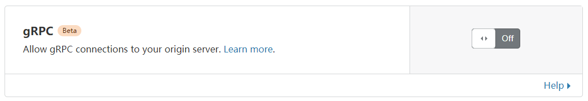

# gun



You know what it means.

## Guide

### Server

1. Go to your domain in CloudFlare. In "Network" tab, turn on gRPC.

2. In "SSL/TLS" tab, choose "Source Servers" sub tab. Create a new certificate and save as `cert.pem` and `cert.key`.

3. In "DNS" Tab, add a record pointing to your own server. Make sure the proxy state is "Proxied".

4. Run and persist this on your server. This example will forward the inbound traffic to `127.0.0.1:8899`.

```bash
gun -mode server -local :443 -remote 127.0.0.1:8899 -cert cert.pem -key cert.key
```

5. If you are using a TLS termination proxy, you can set `-cleartext` parameter to use HTTP/2 Cleartext transport
   protocol.

### Client

1. Assume the domain of server is `grpc.example.com`.

2. Run locally and persist. This will tunnel connections from `127.0.0.1:8899` to remote.

```bash
gun -mode client -local 127.0.0.1:8899 -remote grpc.example.com:443
```

There's also a SIP003 plugin version, see it's [document](cmd/sip003/README) for instruction.

## License

AGPL3
